# Project: Raspberry Pi + Alexa Voice Service

## About the Project
This project demonstrates how to access and test the Alexa Voice Service using a Java client (running on a Raspberry Pi), and a Node.js server. You will be using the Node.js server to get a Login with Amazon authorization code by visiting a website using your computer's (Raspberry Pi in this case) web browser. 

This guide provides step-by-step instructions for obtaining the sample code, the dependencies, and the hardware you need to get the reference implementation running on your Pi.

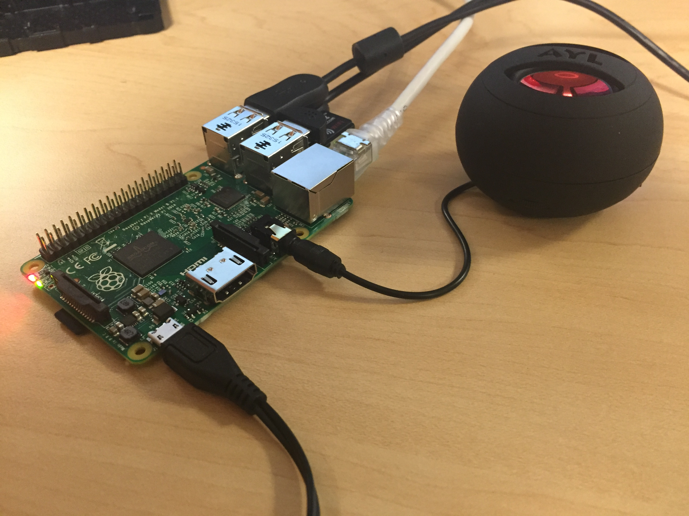

___

## Getting Started

### Hardware you need

1. **Raspberry Pi 2 (Model B)**  - [Buy at Amazon](http://amzn.com/B00T2U7R7I)
2. **Micro-USB power cable** for Raspberry Pi (included with Raspberry Pi)
3. **Micro SD Card** - To get started with Raspberry Pi you need an operating system. NOOBS (New Out Of the Box Software) is an easy-to-use operating system install manager for the Raspberry Pi. The simplest way to get NOOBS is to buy an SD card with NOOBS preinstalled - [Raspberry Pi 8GB Preloaded (NOOBS) Micro SD Card](https://www.amazon.com/gp/product/B00ENPQ1GK/ref=oh_aui_detailpage_o01_s00?ie=UTF8&psc=1) 
4. An **Ethernet cable**
5. **USB 2.0 Mini Microphone** - Raspberry Pi does not have a built-in microphone; to interact with Alexa you'll need an external one to plug in - [Buy at Amazon](http://amzn.com/B00IR8R7WQ)
6. A **USB Keyboard & Mouse**, and an external **HDMI Monitor** - we also recommend having a USB keyboard and mouse as well as an HDMI monitor handy if for some reason you can’t “SSH” into your Raspberry Pi. More on “SSH” later. 
7. WiFi Wireless Adapter (Optional) [Buy at Amazon](http://www.amazon.com/CanaKit-Raspberry-Wireless-Adapter-Dongle/dp/B00GFAN498/)

### Skills you need

1. Basic programming experience
2. Familiarity with shell

---

##  0 - Setting up the Raspberry Pi
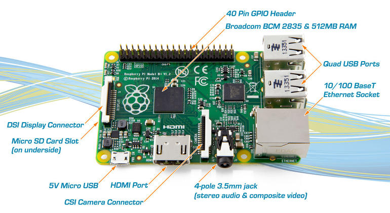

1. Insert the micro SD card with NOOBS preinstalled into the micro SD card slot on your Raspberry Pi. 
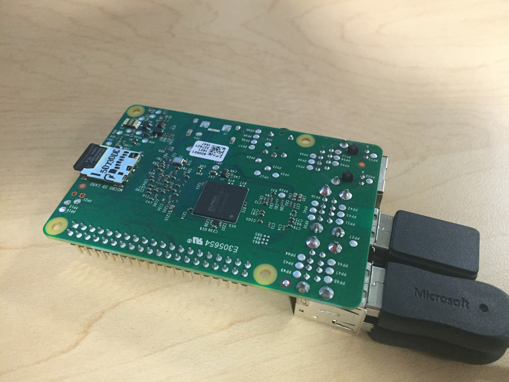
2. Plug in the USB 2.0 Mini Microphone, and the (optional) WiFi Wireless Adapter.
3. Plug in your USB keyboard and mouse. 
4. Connect your monitor using the HDMI port. 

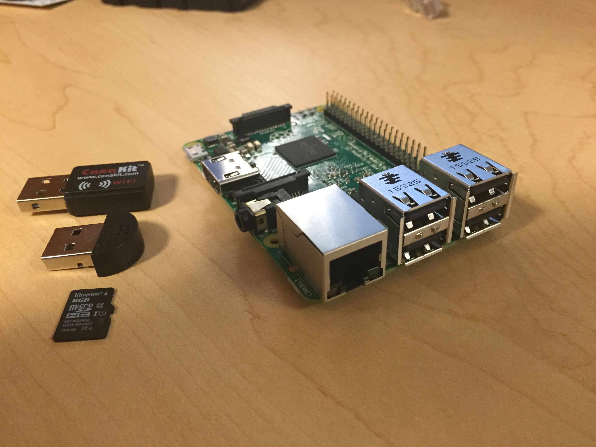
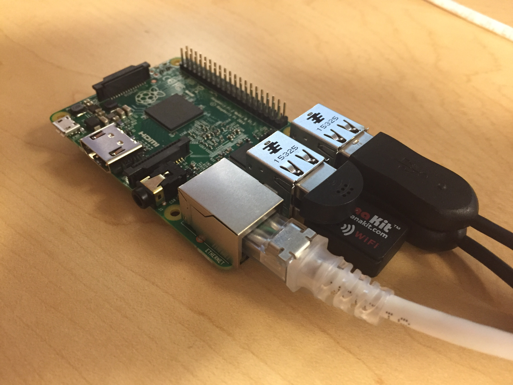

##  1 - Booting up the Raspberry Pi

1. Now plug in the USB power cable to your Pi.
2. Your Raspberry Pi will boot, and a window will appear with a list of different operating systems that you can install. 
3. Tick the box next to **Raspbian** and click on **Install**.

	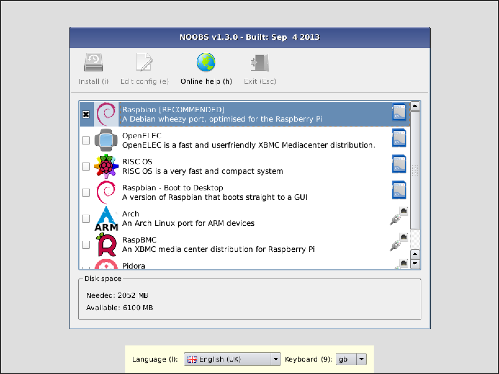

4. Raspbian will then run through its installation process. *Note: this can take a while*.
5. When the installation process has completed, the Raspberry Pi configuration menu (raspi-config) will load. Here you can set the time and date for your region and enable a Raspberry Pi camera board, or even create users. You can exit this menu by using Tab on your keyboard to move to **Finish**.
	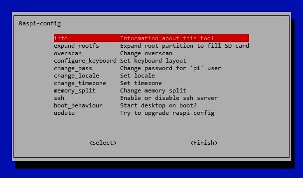
6. Once rebooted, login to your Raspberry Pi. The default login for Raspbian is username **pi** with the password **raspberry**

**NOTE**: To load the graphical user interface at any time type **startx** into the command line. 

More info: [raspberrypi.org](https://www.raspberrypi.org/help/noobs-setup/)

___

## 2 - Installing utilities & dependencies

**NOTE**: You will be using the **Terminal** utility on the Raspberry Pi to install the utilities you need for this Alexa Voice Service walkthrough. Terminal comes preinstalled on the Raspberry Pi, and you can get to it from the Desktop. You can learn more about Terminal [here](https://www.raspberrypi.org/documentation/usage/terminal/).

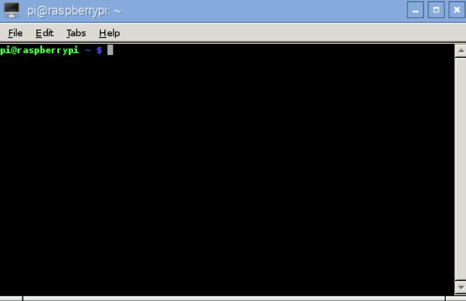

### 2.1 - Enable SSH on Raspberry Pi
SSH allows you to remotely gain access to the command line of a Raspberry Pi from another computer (as long as they are both on the same network). This removes the requirement to have an external monitor connected to your Raspberry Pi.

SSH is **enabled by default** on Raspberry Pi. If you run into problems getting SSH to work, make sure it’s enabled. This is done using the [raspi-config](https://www.raspberrypi.org/documentation/remote-access/ssh/README.md) utility. 

Type the following in the Terminal: 

 	sudo raspi-config

Then navigate to SSH, hit Enter and select Enable SSH server.

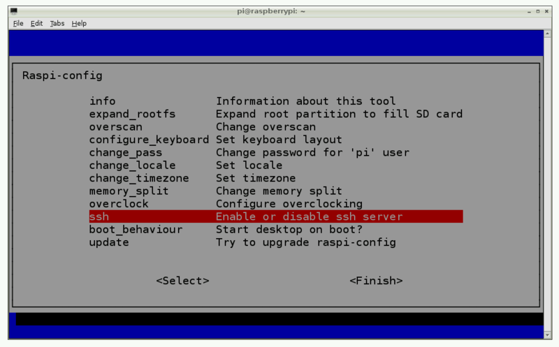

### 2.2 - SSH into the Raspberry Pi

Now let's SSH into your Raspberry Pi. To do that, you need to know the IP address of your Raspberry Pi.

Type this command into the terminal: 

	hostname -I
	> 192.168.1.10 //this is an example Raspberry Pi’s hostname, it would be different for you

If you’re on a Windows PC, follow the instructions here to [SSH Using windows](https://www.raspberrypi.org/documentation/remote-access/ssh/windows.md)

Now that you know the IP address of your Raspberry Pi, you are ready to connect to it remotely using SSH. To do this, open the terminal utility on the computer you would like to connect from and type the following:

	pi@<YOUR Raspberry Pi IP ADDRESS>

It will prompt you for your password. *NOTE*: the default password for the user pi is **raspberry**

Voila! You’re now remotely connected to your Raspberry Pi. Now you’ll install all the utilities while connected remotely via SSH. 

### 2.3 Install VNC Server

VNC is a graphical desktop sharing system that will allow you to remotely control the desktop interface of your Raspberry Pi from another computer. This will come in very handy as you get rid of the external monitor connected to your Raspberry Pi.

	sudo apt-get install tightvncserver

**Start VNC Server**

To start the VNC Server, type: 
	tightvncserver

**Run VNCServer at Startup**

You want to make sure the VNC Server runs automatically after the Raspberry Pi reboots, so you don’t have to manually start it each time with the command *tightvncserver* through SSH. To do that, type the following in the terminal:

	cd /home/pi
	cd .config

Note the '.' at the start of the folder name. This makes it a hidden folder that will not show up when you type 'ls'.

	mkdir autostart
	cd autostart

Create a new configuration by typing the following command:

	nano tightvnc.desktop

Edit the contents of the file with the following text:

	[Desktop Entry]
	Type=Application
	Name=TightVNC
	Exec=vncserver :1
	StartupNotify=false

Type **ctrl-X** and then **Y** to save the changes to the file.

That's it. The next time you reboot the VNC server will restart automatically.

**Connecting to Raspberry Pi via VNC**

- **Mac**: See https://www.raspberrypi.org/documentation/remote-access/vnc/mac.md
- **Windows**: https://www.raspberrypi.org/documentation/remote-access/vnc/windows.md
- **Linux**: https://www.raspberrypi.org/documentation/remote-access/vnc/linux.md

**You may now disconnect the Monitor, keyboard and mouse (if you like)**. Now with SSH (allows remote access to the terminal) and VNC (allows you to remote control the Raspberry Pi’s desktop interface) installed, the external monitor is optional. Feel free to disconnect it from the Raspberry Pi.

### 2.4 - Install VLC

Get VLC media player by typing:

	sudo apt-get install vlc-nox vlc-data

**NOTE**: If you are running on Raspberry Pi and already have VLC installed, you will need to remove two conflicting libraries by running the following commands:

	sudo apt-get remove --purge vlc-plugin-notify
	sudo rm /usr/lib/vlc/plugins/codec/libsdl_image_plugin.so

**Unable to fetch errors**
If you run into some "Unable to fetch" errors while trying to install VLC, try the following: 	

	sudo apt-get update
	sudo apt-get upgrade
	sudo apt-get install vlc-nox vlc-data
	
Source: https://www.raspberrypi.org/forums/viewtopic.php?f=66&t=67399
	
**Make sure VLC is installed correctly**

	whereis vlc

This will tell you where VLC is installed.

Most programs are stored in `/usr/bin`. On my Raspberry Pi, I see:

	vlc: /usr/bin/vlc /usr/lib/vlc /usr/share/vlc /usr/share/man/man1/vlc.1.gz

**Set the environment variables for VLC**

Type the following into the terminal:

	export LD_LIBRARY_PATH=/usr/lib/vlc
	export VLC_PLUGIN_PATH=/usr/lib/vlc/plugins

**Check if the environment variables were set successfully** 

	echo $LD_LIBRARY_PATH
	> /usr/lib/vlc
	
	echo $VLC_PLUGIN_PATH
	> /usr/lib/vlc/plugins

### 2.5 Download and install Node.js

Verify Node isn't already installed. It should print 'command not found'.

	node —version
	> command not found

Now type: 

	sudo apt-get update 
	sudo apt-get upgrade

Set up the apt-get repo source:

	curl -sL https://deb.nodesource.com/setup | sudo bash -

Install Node itself:

	sudo apt-get install nodejs	

### 2.6 Install Java Development Kit

You need to have Java Development Kit (JDK) version 8 or higher installed on the Raspberry Pi. 

**Step 1: Download JDK**
Assuming this is a fresh Raspberry Pi and you do not already have JDK installed, you'll need to download JDK 8 from [Oracle](http://www.oracle.com/technetwork/java/javase/downloads/jdk8-downloads-2133151.html). The binary you are looking for is **Linux ARM 32 Hard Float ABI**.

Download the tar.gz file jdk-8u73-linux-arm32-vfp-hflt.tar.gz from the Oracle link above.

**NOTE**: Although there is a 64-bit ARMv8 that Apple and some other smartphones use, there are no raspberry 64-bit ARM processors on pis yet. More info: [Raspberry Piblog.com](http://www.Raspberry Piblog.com/2014/03/installing-oracle-jdk-8-on-raspberry-pi.html)

**Step 2: Extract the contents**
Extract the contents of the tarball to the /opt directory:

	sudo tar zxvf jdk-8u73-linux-arm32-vfp-hflt.tar.gz -C /opt
	
Set default java and javac to the new installed jdk8.

	sudo update-alternatives --install /usr/bin/javac javac /opt/jdk1.8.0_73/bin/javac 1
	
	sudo update-alternatives --install /usr/bin/java java /opt/jdk1.8.0_73/bin/java 1

	sudo update-alternatives --config javac
	sudo update-alternatives --config java

**NOTE**: If asked to choose an alternative, type the number corresponding to the jdk version you just installed - for example - jdk1.8.0_73

Now verify the commands with the -version option:

	java -version
	javac -version

### 2.7 Install Maven

**Step 1: Download Maven** 

Download the Binary tar.gz file apache-maven-3.3.9-bin.tar.gz from https://maven.apache.org/download.cgi 

**Step 2: Extract the contents**
Extract the contents of the tarball to the /opt directory

	sudo tar zxvf apache-maven-3.3.9-bin.tar.gz	-C /opt

**Step 3: Tell your shell where to find maven** 
You’ll do this in the system profile settings so it is available to all users.

Create a new file /etc/profile.d/maven.sh, and type the following inside it:

	export M2_HOME=/opt/apache-maven-3.3.9
	export PATH=$PATH:$M2_HOME/bin

Save the file. Log out and back into the Raspberry Pi so the profile script takes effect. You can test that it is working with the following command:

	mvn -version

---

## 3 - Getting started with Alexa Voice Service

### 3.1 Register for a free Amazon Developer Account
[Get a free Amazon developer account](https://developer.amazon.com/login.html) if you do not already have one.

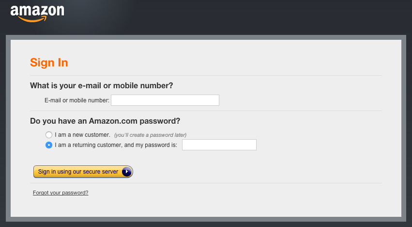
### 3.2 Download the sample app code and dependencies on the Raspberry Pi

[Log in to the Amazon developer portal](https://developer.amazon.com/login.html), and [download the sample apps zip](https://developer.amazon.com/edw/res/download/AlexaVoiceServiceExamples.zip).

By downloading this package, you agree to the [Alexa Voice Service Agreement](https://developer.amazon.com/edw/avs_agreement.html).

### 3.3 Copy and expand the .zip file on your Raspberry Pi

1. Unless you downloaded the zip file on your Raspberry Pi directly, copy and then expand the zip file on your Raspberry Pi. 
2. Make note of its location on your Raspberry Pi. Further instructions will refer to this location as \<REFERENCE_IMPLEMENTATION>

### 3.4 Register your product and create a security profile.

1. Login to Amazon Developer Portal - [developer.amazon.com](https://developer.amazon.com/)
2. Click on Apps & Services tab -> Alexa -> Alexa Voice Service -> Get Started
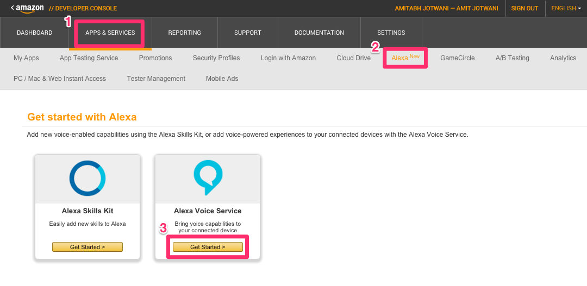
3. In the Register a Product Type menu, select **Device**.
	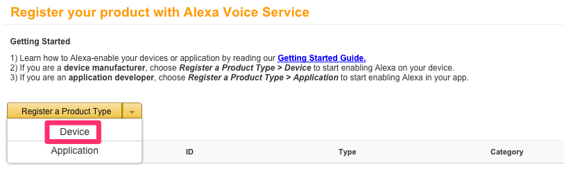
4. Fill in and save the following values:
	
**Device Type Info**

1. Device Type ID: **my_device**
2. Display Name: **My Device**
3. Click **Next**

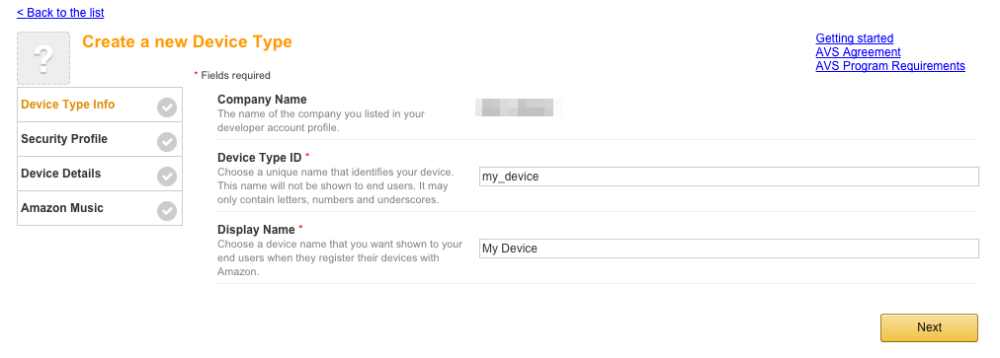

**Security Profile**

1. Click on the Security Profile dropdown and choose “**Create a new profile**”
	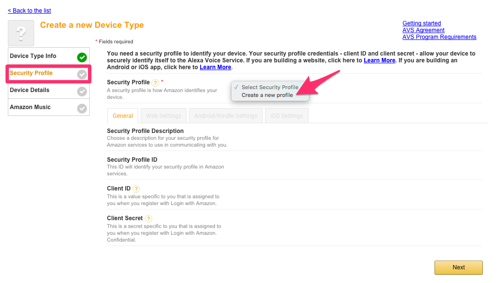

2. **General Tab**
	- **Security Profile Name**: Alexa Voice Service Sample App Security Profile
	- **Security Profile Description**: Alexa Voice Service Sample App Security Profile Description
	- Click **Next**
	
	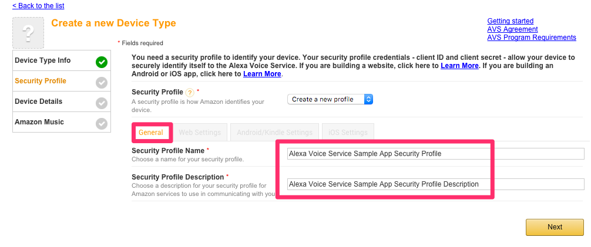
	
Client ID and Client Secret will be generated for you. 
	
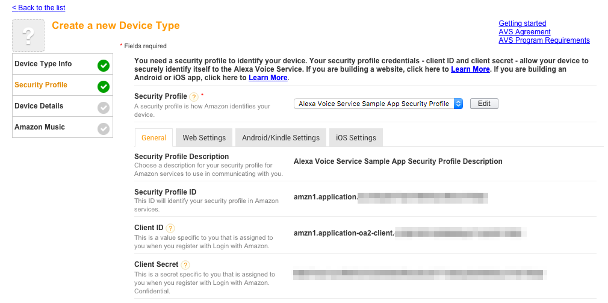

3. Now click on the **Web Settings Tab**
	- Make sure the security profile you just created is selected in the drop-down menu, then click the **"Edit"** button.

	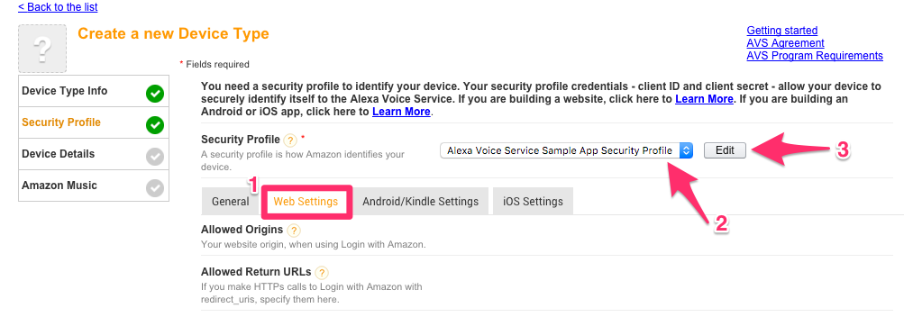
	- **Allowed Origins**: Click "**Add Another**" and then enter **https://localhost:3000** in the text field that appears.
	- **Allowed Return URLs**: Click "Add Another" and then enter **https://localhost:3000/authresponse** in the text field that appears.
	- Click **Next**

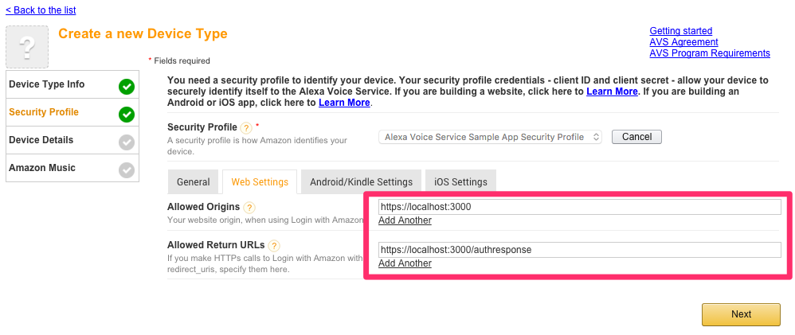

**Device Details**

1. Image: Save the following test image to your computer, then upload it:

2. Category: **Other**
3. Description: **Alexa Voice Service sample app test**
4. What is your expected timeline for commercialization?: **Longer than 4 months / TBD**
5. How many devices are you planning to commercialize?: **0**
6. Click **Next**

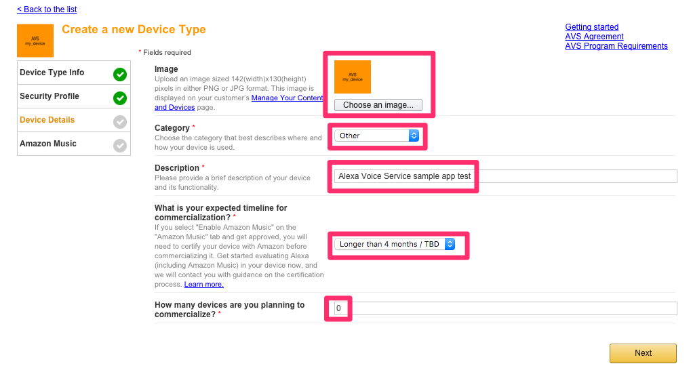

**Amazon Music**

1. Enable Amazon Music?: No (You may optionally select Yes and fill in the required fields if you want to experiment with Amazon Music. However, Amazon Music is not required for basic use of the Alexa Voice Service.)
2. Click the Submit button

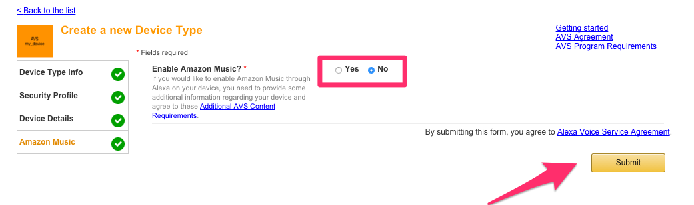

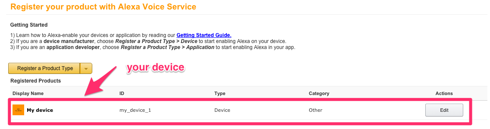

You are now ready to generate self-signed certificates.

___

## 4 - Generate self-signed certificates.

**Step 1: Install SSL**

	sudo apt-get install openssl

**Verify install**

	whereis openssl
	> openssl: /usr/bin/openssl /usr/share/man/man1/openssl.lssl.gz

Change directories to \<REFERENCE_IMPLEMENTATION>/samples/javaclient.

	cd <REFERENCE_IMPLEMENTATION>/samples/javaclient - //your sample apps location

**Step 2**: Edit the text file ssl.cnf, which is an SSL configuration file. Fill in appropriate values in place of the placeholder text that starts with YOUR_. 

Note that **countryName** must be two characters. If it is not two characters, certificate creation will fail. 

**Step 3**: Make the certificate generation script executable by typing:

	chmod +x generate.sh

**Step 4**: Run the certificate generation script:
	
	./generate.sh
	
**Step 5**: You will be prompted for some information:

1. When prompted for a product ID, enter **my_device**
2. When prompted for a serial number, enter **123456**
3. When prompted for a password, enter any password and remember what you entered 
	1. Password: **talktome** (you can even leave it blank)

**Step 6: Edit the configuration file for the Node.js server**  

The configuration file is located at: 

	<REFERENCE_IMPLEMENTATION>/samples/companionService/config.js. 

Make the following changes:

- Set **sslKey** to \<REFERENCE_IMPLEMENTATION>/samples/javaclient/certs/server/node.key
- Set **sslCert** to \<REFERENCE_IMPLEMENTATION>/samples/javaclient/certs/server/node.crt
- Set **sslCaCert** to \<REFERENCE_IMPLEMENTATION>/samples/javaclient/certs/ca/ca.crt

**IMP**: **Do not** use **~** to denote the home directory. Use the absolute path instead. So, instead of ~/documents/samples, use /home/pi/documents/samples.

**Step 7: Edit the configuration file for the Java client** 

The configuration file is located at: 

	<REFERENCE_IMPLEMENTATION>/samples/javaclient/config.json. 

Make the following changes:

- Set **companionApp.sslKeyStore** to \<REFERENCE_IMPLEMENTATION>/samples/javaclient/certs/server/jetty.pkcs12
- Set **companionApp.sslKeyStorePassphrase** to the passphrase entered in the certificate generation script in step 5 above.
- Set **companionService.sslClientKeyStore** to \<REFERENCE_IMPLEMENTATION>/samples/javaclient/certs/client/client.pkcs12
- Set **companionService.sslClientKeyStorePassphrase** to the passphrase entered in the certificate generation script in step 5 above.
- Set **companionService.sslCaCert** to \<REFERENCE_IMPLEMENTATION>/samples/javaclient/certs/ca/ca.crt

---

## 5 - Install the dependencies

Change directories to \<REFERENCE_IMPLEMENTATION>/samples/companionService

	cd <REFERENCE_IMPLEMENTATION>/samples/companionService

Install the dependencies by typing:

	npm install

___

## 6 - Enable Security Profile

1. Open a web browser, and visit [https://developer.amazon.com/lwa/sp/overview.html](https://developer.amazon.com/lwa/sp/overview.html).
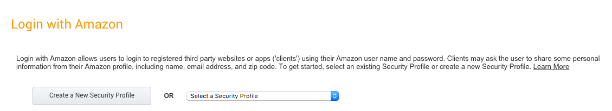

2. Near the top of the page, select the security profile you created earlier from the drop down menu and click **Confirm**.
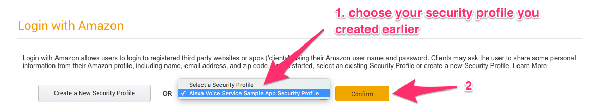
3. Enter a privacy policy URL beginning with http:// or https://. For this example, you can enter a fake URL such as http://example.com. 
4. [Optional] You may upload an image as well. The image will be shown on the Login with Amazon consent page to give your users context. 
5. Click Save.
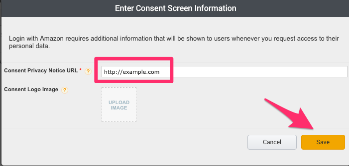

6. Next to the Alexa Voice Service Sample App Security Profile, click Show Client ID and Client Secret. This will display your client ID and client secret. Save these values. You’ll need these. 
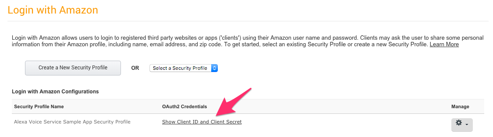

## 7 - Updating the config files

**Login to the Raspberry Pi via VNC**

**Step 1: Update config.js**
Navigate to the following file and open it in a text editor.

-

	<REFERENCE_IMPLEMENTATION>/samples/companionService/config.js 	

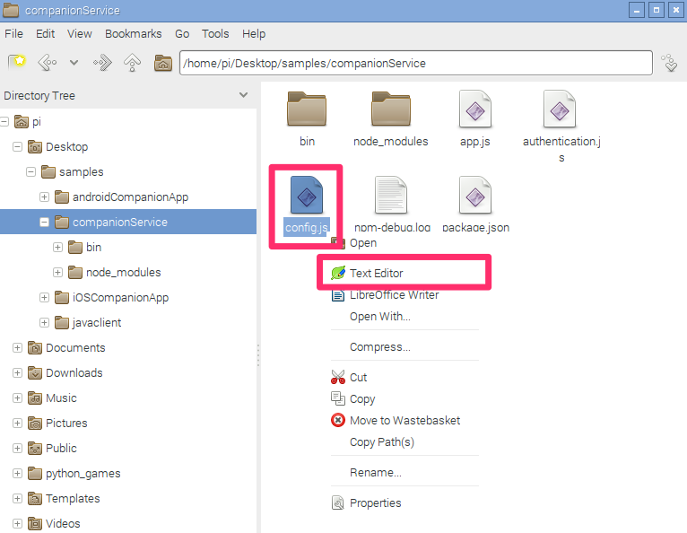
Edit the following values in this file -

- **clientId**: Paste in the client ID that you noted in the previous step as a string.
- **clientSecret**: Paste in the client secret that you noted in the previous step as a string.
- **products**: The product's object consists of a key that should be the same as the product type ID that you set up in the developer portal and a value that is an array of unique product identifiers. If you followed the instructions above, the product type ID should be my_device. The unique product identifier can be any alphanumeric string, such as 123456. Example products JSON is: `products: {"my_device": ["123456"]}`

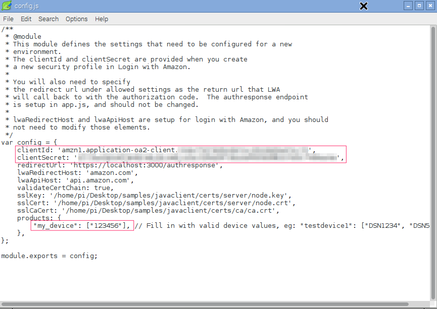

**Save** the file.

**Step 2: Update config.json**
Navigate to the following file, and open it in  a text editor.

-

	<REFERENCE_IMPLEMENTATION>/samples/javaclient/config.json	

Edit the following values in this file:

- **productId**: Enter **my_device** as a string.
- **dsn**: Enter the alphanumeric string that you used for the unique product identifier in the products object in the server's config.js. For example: **123456**.
- **provisioningMethod**: Enter **companionService**.

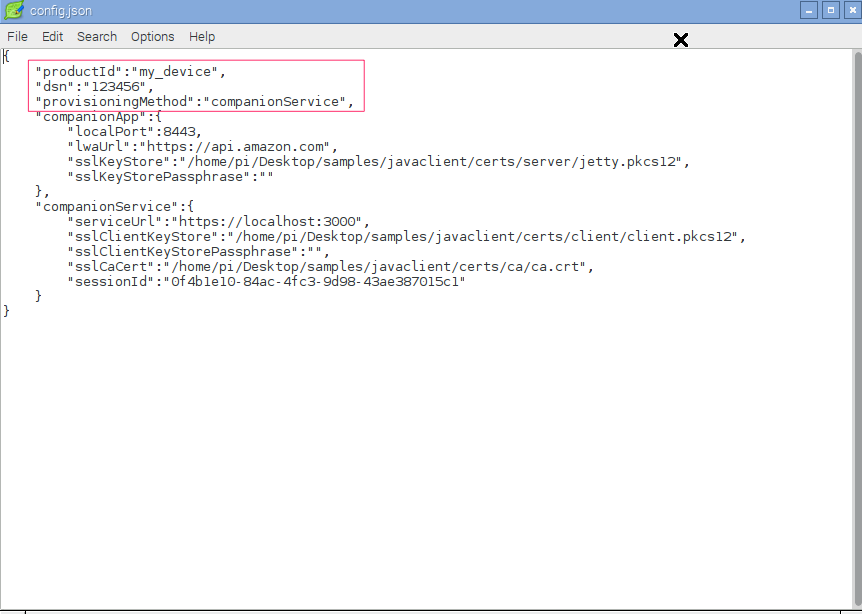

**Save** the file.

**Step 3: Preparing the pom.xml file**

Navigate to the following file and open it in a text editor.

-

	\<REFERENCE_IMPLEMENTATION>/samples/javaclient/pom.xml	

Add the following to the pom.xml in the **< dependencies >** section:

	<dependency>
	  <groupId>net.java.dev.jna</groupId>
	  <artifactId>jna</artifactId>
	  <version>4.1.0</version>
	  <scope>compile</scope>
	</dependency>

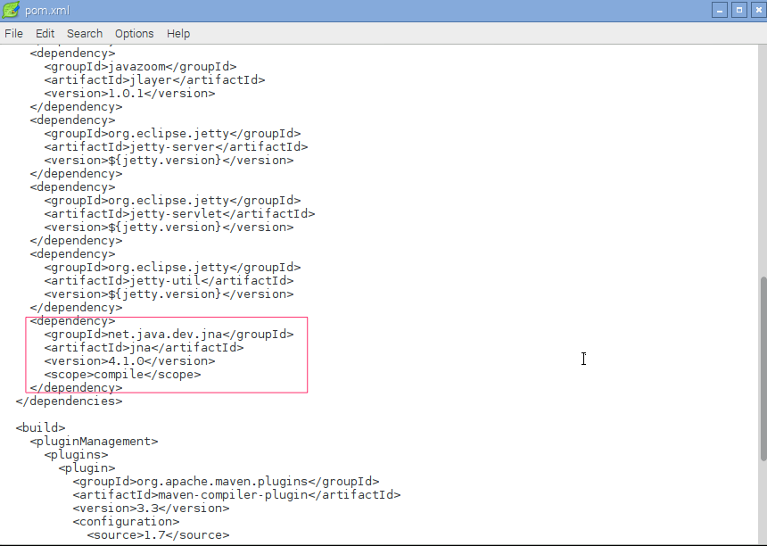
___

## 8 - Run the server

**Login to the Raspberry Pi via VNC**

In your terminal window or from the command prompt, type: 

	cd \<REFERENCE_IMPLEMENTATION>/samples/companionService
	npm start

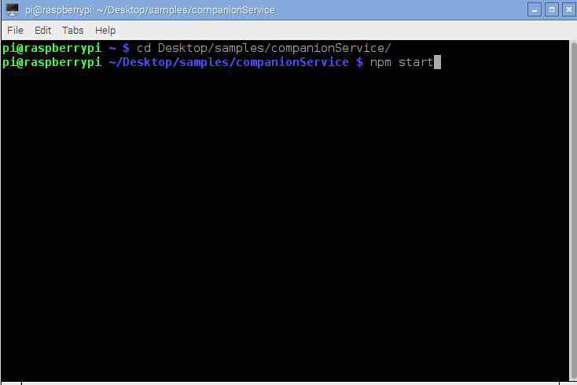
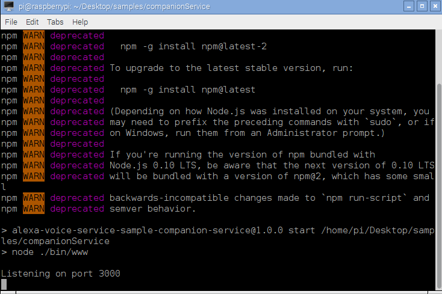

The server is now running on port 3000 and you are ready to start the client.

___

## 9 - Start the client

Open a new terminal window/tab (SHIFT+CTRL+TAB in Raspbian)

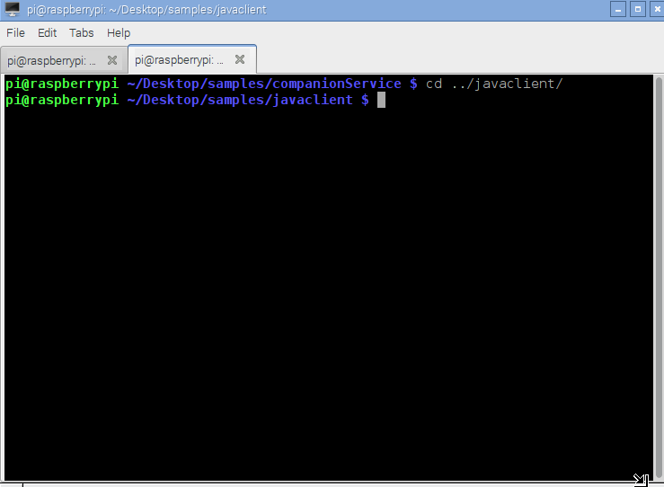

	cd \<REFERENCE_IMPLEMENTATION>/samples/javaclient

**Upgrade your Java version**

Make the script executable by typing:

	chmod +x generate.sh

Run the installation script:
	
	./install-java8.sh

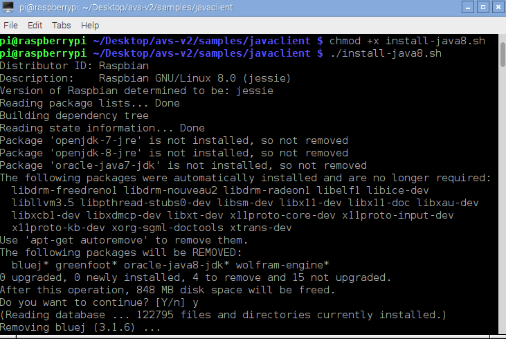

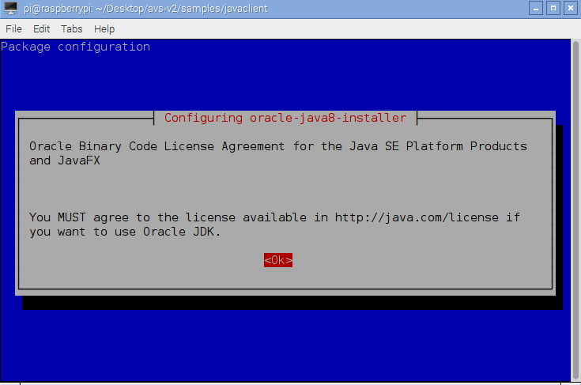

You will get a message from Oracle Java installer that you must accept the Terms of Service for Java SE Platform, press Enter.

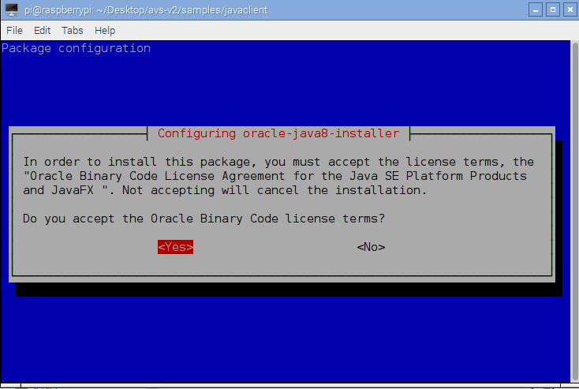

Press **Tab**, and then **Enter** to say “**Yes**” to the Terms of Service.

**Build the app**

Before you build the app, let’s validate to make sure the project is correct and that all necessary information is available. You do that by running:

	mvn validate

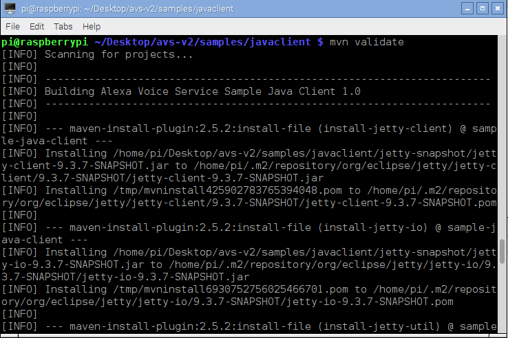

Download dependencies and build the app by typing: 

	mvn install	

When the installation is completed, you will see a “Build Success” message in the terminal. 

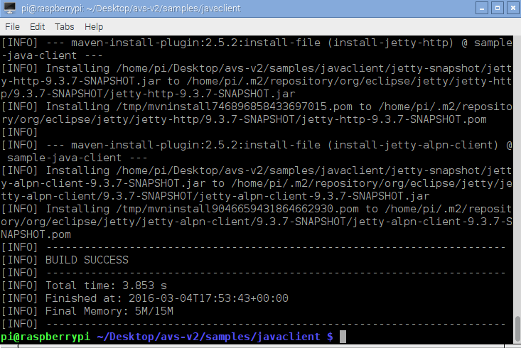

**Run the client app**:

You are now ready to run the client app by typing:

	mvn exec:exec

## 10 - Obtain Authorization from Login with Amazon

1. When you run the client, a window should pop up with a message that says something similar to:  

	*Please register your device by visiting the following website on any system and following the instructions: https://localhost:3000/provision/d340f629bd685deeff28a917 Hit OK once completed*.

	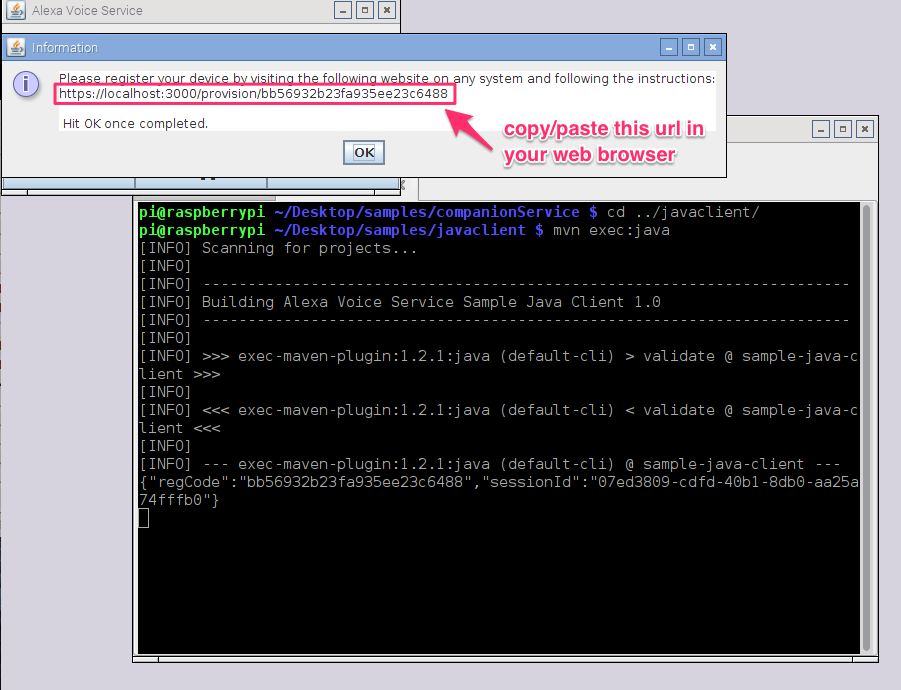

	**Copy** the URL from the popup window and **paste** it into a **web browser**. In this example, the URL to copy and paste is https://localhost:3000/provision/d340f629bd685deeff28a917. 

	
**NOTE:** Due to the use of a self-signed certificate, you will see a warning about an insecure website. This is expected. It is safe to ignore the warnings during testing.

2. You will be taken to a Login with Amazon web page. Enter your Amazon credentials.

	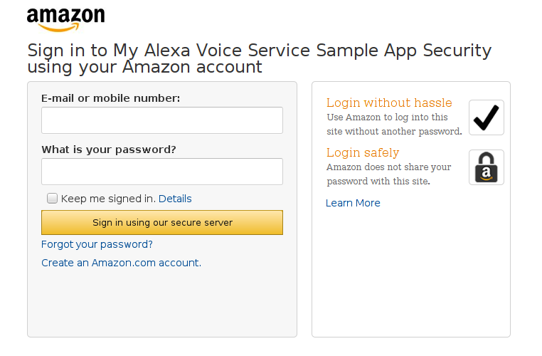
	
3. You will be taken to a Dev Authorization page, confirming that you’d like your device to access the Security Profile created earlier. 
	
	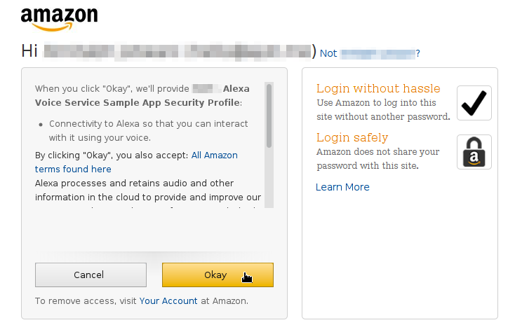
	
	Click **Okay**. 
	
4. You will now be redirected to a URL beginning with https://localhost:3000/authresponse followed by a query string. The body of the web page will say **device tokens ready**.

	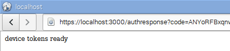

5. **Return to the Java application** and click the OK button. The client is now ready to accept Alexa requests.
	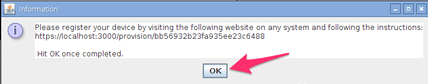

6. Click the **Start Listening** button and wait for the **audio cue** before beginning to speak. It may take a second or two for the connection to be made before you hear the audio cue.

	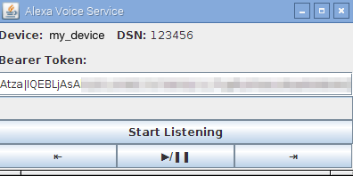
	
Press the **Stop Listening** button when you are done speaking.

	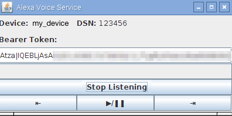	

___

## Let’s talk to Alexa  

**Ask for Weather**: 
*Click the Start Listening button*.
**You**: What's the weather in Seattle?
*Click the Stop Listening button*.
**Alexa**: Current weather report for Seattle
	
**Some other fun questions you can ask Alexa**

Once you hear the audio cue after clicking “Start Listening” button, here are a few things you can try saying -

- **Request Music Playback**: Play Bruce Springsteen
- **General Knowledge**: What's the mass of the sun in grams?
- **Geek**: What are the three laws of robotics?
- **Fun**: Can you rap?
- **Set a Timer**: Set the timer for 2 minutes.
- **Set Alarm**: Set the alarm for 7:30 a.m.

**More on Music Playback**
The "previous", "play/pause", and "next" buttons at the bottom of the Java client UI are to demonstrate the music button events. Music button events allow you to initiate changes in the playback stream without having to speak to Alexa. For example, you can press the "play/pause" button to pause and restart a track of music. 

To demonstrate the "play/pause" button, you can speak the following command: Play DC101 on iHeartRadio, then press the "play/pause" button. The music will pause in response to the button click. Press the "play/pause" button again to restart the music.

___

## 11 - FAQs

### I got the Raspberry Pi working with AVS, but I can’t hear the audio response from Alexa

Check to see if you are seeing the response coming through on the Terminal and if you see the response cards on your Alexa app. If yes, you probably need to force audio through local 3.5mm jack, instead of the HDMI output (this can happen even if you don’t have an HDMI monitor plugged in). 

To force audio through local 3.5 mm jack, pen Terminal, and type

	sudo raspi-config 

See [Raspberry Pi Audio Configuration](https://www.raspberrypi.org/documentation/configuration/audio-config.md)

### How do I find the IP address of my Raspberry Pi?
	
	hostname -I
	
### Unable to fetch errors - 
If you run into some "Unable to fetch" errors while trying to install VLC, try the following - 	

	sudo apt-get update
	sudo apt-get upgrade
	sudo apt-get install vlc-nox vlc-data